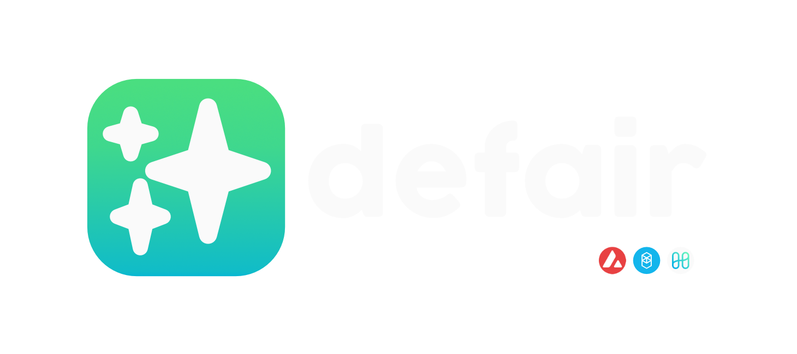

# defair

<p align="center" markdown="1">
  
  <a href="https://github.com/ahstn/defair-api/actions">
    
  </a>
  <a href="https://codecov.io/gh/ahstn/defair-api">
    
  </a>
</p>

> Aiming to make navigating & tracking decentralised finance fair for all.

## Contributing
Building & running Go application:
```bash
# fetch dependencies
go mod download

# run server
go run ./cmd/defair/defair.go server

# fetch liquidity pools
# curl -s "localhost:9000/pools/${YOUR ADDRESS}"
```

Adding a new Smart Contract or ABI:
```bash
# '--type' being arbitrary and an indentifer for the Go Type generated:
abigen --abi JoeMasterChef.abi --pkg main --type MasterChef --out joe-masterchef-v2.go
abigen --abi TokenPair.abi  --pkg contracts --type TokenPair --out token-pair.go
```
